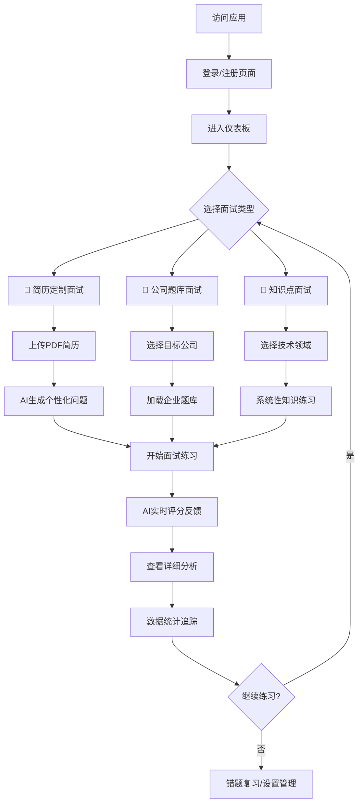

# 🤖 AI智能面试练习平台

<div align="center">
  <p>一个基于 Vue 3 的现代化 AI 智能面试练习平台，通过AI技术模拟真实面试场景，帮助用户提升面试技巧，轻松拿到心仪Offer</p>

  **✨ 采用 Element Plus + 原生CSS架构，像素级还原原型设计**
</div>

---

## 📋 项目概述

这是一个**生产级别的现代化Vue应用**，集成了AI驱动的个性化面试练习、完整的学习数据分析和优秀的用户体验设计。项目采用微服务架构，支持三种核心面试模式，并提供丰富的数据统计和学习反馈功能。

### 🎯 核心价值
- 🤖 **AI驱动个性化**：基于简历和历史数据生成定制化面试问题
- 📊 **完整学习闭环**：练习 → 评估 → 分析 → 改进 → 再练习
- 🚀 **现代化技术栈**：Vue 3 + Element Plus + 微服务架构
- 💼 **企业级质量**：完善的工程化配置和代码规范

---

## ✨ 功能特性

### 🎯 核心面试功能
- 🤖 **AI智能面试**: 基于AI技术的智能面试问答系统
- 📄 **简历定制面试**: 上传PDF简历，AI根据个人经历生成个性化面试问题
- 🏢 **公司题库面试**: 覆盖阿里巴巴、腾讯、百度、字节跳动等名企真实面试题库
- 🧠 **知识点面试**: 按技术领域分类的系统性面试练习
- 🎯 **智能评分系统**: 面试后获得AI专业评分和详细改进建议

### 📊 数据管理与分析
- 📈 **学习进度跟踪**: ECharts可视化学习进度，支持周/月/年时间筛选
- ❌ **智能错题集**: 自动收集错题，支持重点复习和知识点强化
- 📚 **面试历史记录**: 完整的面试轨迹追踪和历史数据回顾
- 📊 **详细统计分析**: 面试次数、平均评分、掌握题目等多维度数据分析
- 🏆 **学习成就系统**: 基于学习进度的成就解锁和激励机制

### 🎨 用户体验设计
- 🌙 **智能主题系统**: 明暗模式 + 自动检测系统偏好 + localStorage持久化
- 📱 **完美响应式设计**: 桌面端固定布局 + 移动端抽屉式导航
- 💫 **现代化UI界面**: Element Plus企业级组件 + 472行CSS变量设计系统
- 🔔 **实时通知反馈**: 面试结果、系统消息、学习推荐等智能提醒
- ⚡ **流畅交互动画**: 基于CSS变量的主题切换和组件过渡效果

---

## 🛠️ 技术架构

### 🏗️ 核心技术栈
- **前端框架**: Vue 3.2.13 (Composition API + `<script setup>` 语法)
- **路由管理**: Vue Router 4.5.1 (路由懒加载 + 智能路由守卫)
- **UI组件库**: Element Plus 2.11.3 (完整企业级组件 + 图标库)
- **HTTP客户端**: Axios 1.6.0 (多实例API + 自动token刷新)
- **样式系统**: 原生CSS + CSS变量系统 (472行完整设计令牌)
- **图表可视化**: ECharts (学习进度统计和数据分析)
- **构建工具**: Vue CLI 5.0 (现代化构建配置)

### 🔧 开发工具链
- **代码规范**: ESLint 7.32 + Vue官方规则 + 自动格式化
- **图标支持**: FontAwesome 6 (CDN) + Element Plus Icons
- **状态管理**: Composition API全局状态 (无需Vuex/Pinia)
- **主题系统**: CSS变量驱动 + 系统主题自动检测
- **类型支持**: JavaScript + 严格Props验证

### 🌐 微服务API架构
```javascript
authApi      // 用户认证服务 - JWT双token机制
pdfApi       // PDF文件解析服务 - 简历内容提取
analysisApi  // 简历分析服务 - AI智能分析
vectorApi    // 向量存储服务 - 知识图谱构建
interviewApi // 面试记录服务 - 历史数据管理
```

**架构特色**:
- ✅ **自动Token刷新**: 401错误时自动刷新token并重试请求
- ✅ **统一错误处理**: 集中化的错误消息和网络状态处理
- ✅ **服务实例隔离**: 不同业务逻辑使用独立的服务实例
- ✅ **超时配置**: 针对不同服务类型的差异化超时策略

---

## 📁 项目架构

### 🏗️ 目录结构
```
src/
├── api/                    # API服务层
│   ├── index.js               # 多实例API配置 + 拦截器
│   ├── constants.js           # API端点和配置常量
│   ├── utils.js               # token工具和错误处理
│   ├── auth.js                # 认证相关API
│   ├── user.js                # 用户信息API
│   ├── resume.js              # 简历处理API
│   └── interview.js           # 面试数据API
├── components/             # 组件库
│   ├── common/                # 通用业务组件
│   │   ├── StatCard.vue           # 数据统计卡片 (支持4种主题色)
│   │   └── QuickStartCard.vue     # 快速操作卡片 (支持点击事件)
│   └── layout/                # 布局组件系统
│       ├── AppLayout.vue          # 主布局容器 (响应式设计)
│       ├── AppHeader.vue          # 顶部导航栏 (主题切换 + 通知系统)
│       └── AppSidebar.vue         # 侧边栏导航 (热门公司 + 快捷操作)
├── composables/            # 组合式函数 (全局状态管理)
│   ├── useAuth.js             # 认证状态管理 (JWT + localStorage)
│   ├── useTheme.js            # 主题切换管理 (明暗模式 + 系统检测)
│   └── useResumeCache.js      # 简历缓存管理
├── views/                  # 页面组件 (路由懒加载)
│   ├── Login.vue              # 登录页面 (双面板设计 + 功能介绍)
│   ├── Dashboard.vue          # 仪表板首页 (743行完整实现)
│   ├── ResumeInterview.vue    # 简历定制面试 (PDF上传 + AI分析)
│   ├── CompanyInterview.vue   # 公司题库面试 (企业题库选择)
│   ├── KnowledgeInterview.vue # 知识点面试 (技术领域分类)
│   ├── InterviewHistory.vue   # 面试历史记录
│   ├── WrongQuestions.vue     # 错题集管理
│   ├── Statistics.vue         # 学习统计分析
│   └── Settings.vue           # 个人设置页面
├── router/                 # 路由配置
│   └── index.js               # 嵌套路由 + 路由守卫 + 懒加载
├── styles/                 # 样式系统
│   └── main.css               # CSS变量系统 (472行完整设计令牌)
└── main.js                 # 应用入口 + Element Plus配置

project_document/           # 项目文档目录
├── README.md                  # 文档目录说明
├── [000]功能模块文档.md      # 前端功能模块完整说明
├── [001]前后端API对接文档.md # API接口对接详细文档
├── [002]后端微服务架构文档.md # 后端服务架构参考
├── [200]前后端对接问题记录.md # 集成问题跟踪
└── [201]后端服务集成状态报告.md # 服务集成测试报告
```

### 📚 项目文档

详细的项目文档请查看 [project_document/](./project_document/) 目录：

- **[功能模块文档](./project_document/[000]功能模块文档.md)**: 完整的功能模块说明和技术实现
- **[前后端API对接文档](./project_document/[001]前后端API对接文档.md)**: API接口详细对接说明
- **[后端微服务架构文档](./project_document/[002]后端微服务架构文档.md)**: 后端服务架构参考
- **[前后端对接问题记录](./project_document/[200]前后端对接问题记录.md)**: 集成问题跟踪记录
- **[后端服务集成状态报告](./project_document/[201]后端服务集成状态报告.md)**: 服务状态和测试报告

### 🎨 CSS变量设计系统
```css
:root {
  /* 品牌色彩系统 */
  --color-primary: #1890ff;         /* 主色调 */
  --color-primary-hover: #40a9ff;   /* 悬停态 */
  --color-success: #52c41a;         /* 成功色 */
  --color-warning: #faad14;         /* 警告色 */
  --color-error: #f5222d;           /* 错误色 */

  /* 文本色阶系统 */
  --text-color-primary: #262626;    /* 主要文本 */
  --text-color-secondary: #595959;  /* 次要文本 */
  --text-color-tertiary: #8c8c8c;   /* 辅助文本 */

  /* 布局系统 */
  --header-height: 64px;            /* 标准头部高度 */
  --sidebar-width: 256px;           /* 侧边栏宽度 */
  --content-max-width: 1200px;      /* 内容最大宽度 */

  /* 间距系统 (8pt网格) */
  --spacing-xs: 4px;   --spacing-md: 16px;
  --spacing-sm: 8px;   --spacing-lg: 24px;

  /* 动画系统 */
  --transition-fast: 0.15s cubic-bezier(0.4, 0, 0.2, 1);
  --transition-normal: 0.3s cubic-bezier(0.4, 0, 0.2, 1);
}

/* 暗色模式变量 */
.dark {
  --bg-color-page: #141414;         /* 暗色页面背景 */
  --bg-color-container: #1f1f1f;    /* 暗色容器背景 */
  --text-color-primary: #f0f0f0;    /* 暗色主文本 */
}
```

---

## 🔄 完整业务流程

### 🚪 用户旅程设计


### 🎯 三种核心面试模式

#### 1. 📄 简历定制面试 (`/interview/resume`)
**业务流程**:
```
用户上传PDF简历 → 服务状态检查 → 文件解析验证
→ AI提取简历内容 → 生成个性化问题 → 开始面试练习
```

**技术实现**:
- **文件上传**: Element Plus Upload组件 + 拖拽支持
- **格式限制**: 仅支持PDF格式，最大5MB
- **服务监控**: PDF解析服务状态实时检查和错误处理

#### 2. 🏢 公司题库面试 (`/interview/company`)
**业务流程**:
```
选择目标公司 → 选择职位类型 → 加载企业题库
→ 针对性练习 → 获得行业insights → 持续改进
```

**覆盖企业**: 阿里巴巴、腾讯、百度、字节跳动、美团、小米等

#### 3. 🧠 知识点面试 (`/interview/knowledge`)
**业务流程**:
```
选择技术领域 → 选择难度等级 → 系统性练习
→ 知识点强化 → 能力图谱构建 → 学习路径推荐
```

**技术领域**: 前端开发、后端开发、算法数据结构、系统设计等

---

## 🚀 快速开始

### 📋 环境要求
- **Node.js**: >= 14.0.0 (推荐 16+)
- **npm**: >= 6.0.0 (推荐 8+)
- **现代浏览器**: Chrome 90+, Firefox 88+, Safari 14+

### ⚡ 安装与运行
```bash
# 克隆项目
git clone <repository-url>
cd front_end

# 安装依赖
npm install

# 启动开发服务器 (支持热重载)
npm run serve

# 构建生产版本
npm run build

# 代码检查和格式化
npm run lint
```

### 🔧 开发脚本说明
- `npm run serve`: 启动开发服务器，默认 http://localhost:8080
- `npm run build`: 构建生产版本到 `dist/` 目录
- `npm run lint`: ESLint代码检查，自动修复格式问题

---

## 📊 性能优化策略

### ⚡ 代码分割与懒加载
```javascript
// 路由级别的代码分割
const Dashboard = () => import('../views/Dashboard.vue')
const Login = () => import('../views/Login.vue')
// 所有路由组件均采用懒加载，减少初始bundle大小
```

### 🔄 API请求优化
```javascript
// 多实例API设计
const authApi = axios.create({
  baseURL: API_ENDPOINTS.AUTH,
  timeout: TIMEOUT_CONFIG.DEFAULT
})

// 自动token刷新机制
if (error.response?.status === 401 && !originalRequest._retry) {
  const refreshResponse = await authApi.post('/auth/refresh')
  return axios(originalRequest) // 重试原始请求
}
```


### 🎨 主题切换优化
```javascript
// CSS变量驱动的动态主题
const updateTheme = () => {
  document.documentElement.classList.toggle('dark', isDark.value)
}
// 避免重新编译样式，实现无缝主题切换
```

---

## 🛡️ 安全性设计

### 🔐 认证安全机制
- **JWT双token机制**: access_token + refresh_token
- **自动过期处理**: token失效时自动跳转登录页面
- **路由守卫保护**: 所有敏感页面需要认证才能访问
- **会话管理**: localStorage持久化 + 内存状态管理

### 🔒 数据安全策略
```javascript
// 敏感信息安全存储
tokenUtils.setAccessToken(token)     // 安全的token存储
tokenUtils.clearAuth()               // 登出时完全清理
// 用户敏感数据加密传输和存储
```

### 🚫 输入验证
- **文件上传限制**: PDF格式验证 + 文件大小限制
- **表单数据验证**: Element Plus内置验证 + 后端双重验证
- **API参数校验**: 严格的参数类型和范围检查

---

## 📱 响应式设计

### 🖥️ 断点系统
```css
/* 移动端优先的响应式设计 */
@media (max-width: 767px) {
  .content-area { padding: var(--spacing-md); }
  .app-sidebar { transform: translateX(-100%); }
}

@media (min-width: 768px) {
  .sidebar-overlay { display: none; }
  .app-sidebar { transform: translateX(0); }
}
```

### 📐 布局适配策略
- **桌面端** (≥768px): 固定侧边栏 + 主内容区布局
- **移动端** (<768px): 汉堡菜单 + 抽屉式侧边栏 + 遮罩背景
- **自适应切换**: 基于视口宽度的智能布局切换

---

## 🏆 项目优势与特色

### ✅ 技术优势
- **🚀 现代化技术栈**: Vue 3 + Composition API + Element Plus
- **⚡ 性能优化**: 路由懒加载 + 代码分割 + 智能缓存
- **🎨 设计系统**: 472行CSS变量 + 统一设计令牌
- **🔧 工程化**: ESLint规范 + 热重载开发 + 自动化构建
- **📱 响应式**: 桌面端和移动端的完美适配

### 🎯 业务优势
- **🤖 AI驱动**: 个性化问题生成 + 智能评分反馈
- **📊 数据洞察**: 完整的学习分析和进度追踪
- **🔄 学习闭环**: 练习→评估→分析→改进的完整流程
- **🏢 行业覆盖**: 名企题库 + 多技术领域支持

### 💼 商业价值
- **👥 用户价值**: 提升面试成功率 + 节省学习时间
- **🔧 技术价值**: 可扩展架构 + 现代技术栈
- **📈 市场价值**: AI面试赛道的技术领先优势

---

## 🔮 未来发展规划

### 📈 功能扩展方向
1. **🎥 视频面试模拟**: 集成WebRTC技术进行真人视频面试练习
2. **🏭 行业细分**: 针对金融、医疗、教育等不同行业的专业题库
3. **👥 团队协作**: 企业版本支持HR和候选人的协作练习
4. **📱 原生移动端**: 开发iOS/Android原生应用

### 🔧 技术演进路线
1. **📝 TypeScript迁移**: 全面类型化提升开发体验和代码质量
2. **🚀 服务端渲染(SSR)**: Nuxt.js集成提升SEO和首屏性能
3. **📱 PWA支持**: 离线可用 + 推送通知 + 应用级体验
4. **🧩 微前端架构**: 支持多团队并行开发和独立部署

### 🤖 AI能力升级
1. **🧠 深度学习模型**: 更精准的面试评分和建议生成
2. **🎯 个性化推荐**: 基于学习数据的智能内容推荐
3. **📊 能力画像**: 多维度的技能评估和成长路径规划
4. **🔍 市场洞察**: 行业趋势分析和薪资预测功能

---

## 🔧 开发指南

### 📝 代码规范
```javascript
// 组件命名: PascalCase
const StatCard = defineComponent({...})

// 文件命名: PascalCase.vue
StatCard.vue, QuickStartCard.vue

// CSS类名: kebab-case + BEM
.stat-card__header, .quick-start--active

// 函数命名: camelCase
const handleUploadSuccess = () => {...}
```

### 🎨 样式开发规范
```css
/* 优先使用CSS变量 */
.custom-button {
  background-color: var(--color-primary);
  padding: var(--spacing-md);
  border-radius: var(--border-radius);
  transition: var(--transition-normal);
}

/* 响应式断点使用标准值 */
@media (max-width: 767px) { /* 移动端 */ }
@media (min-width: 768px) { /* 桌面端 */ }
```

### 🔨 提交规范
```bash
feat: 新功能开发
fix: 修复bug
docs: 文档更新
style: 代码格式调整
refactor: 代码重构
perf: 性能优化
test: 测试相关
chore: 构建配置等
```

---

## 🚀 部署指南

### 📦 构建生产版本
```bash
# 构建优化的生产版本
npm run build

# 构建结果在 dist/ 目录
ls dist/
├── index.html
├── css/
├── js/
└── static/

# 可部署到任何静态文件服务器
```

### ⚙️ 生产环境配置
- **路由模式**: History模式，需要服务器支持fallback配置
- **CDN资源**: FontAwesome通过CDN加载，确保网络可访问性
- **组件库**: Element Plus已打包到bundle，无需额外CDN
- **环境变量**: 支持 `.env.production` 生产环境配置

### 🌐 服务器配置示例
```nginx
# Nginx配置示例
server {
  listen 80;
  server_name your-domain.com;
  root /path/to/dist;
  index index.html;

  # 支持Vue Router History模式
  location / {
    try_files $uri $uri/ /index.html;
  }

  # 静态资源缓存
  location ~* \.(js|css|png|jpg|jpeg|gif|ico|svg)$ {
    expires 1y;
    add_header Cache-Control "public, immutable";
  }
}
```

---

## 🤝 贡献指南

### 📋 参与贡献
1. **Fork项目**: 点击右上角Fork按钮
2. **创建分支**: `git checkout -b feature/amazing-feature`
3. **提交代码**: `git commit -m 'feat: add amazing feature'`
4. **推送分支**: `git push origin feature/amazing-feature`
5. **创建PR**: 在GitHub上创建Pull Request

### 🐛 问题反馈
- **Bug报告**: 使用GitHub Issues，提供详细的复现步骤
- **功能建议**: 在Issues中使用`enhancement`标签
- **安全问题**: 请通过邮件私下联系维护者

### 📖 文档贡献
- 改进README文档
- 添加代码注释
- 编写使用教程
- 翻译多语言版本

---

## 📊 项目统计

| 项目指标 | 数值 | 说明 |
|---------|------|------|
| **代码行数** | ~15,000+ | 包含Vue组件、样式、配置文件 |
| **组件数量** | 20+ | 页面组件 + 通用组件 |
| **CSS变量** | 472行 | 完整的设计系统令牌 |
| **API端点** | 5个服务 | 微服务架构设计 |
| **路由页面** | 9个主页面 | 包含嵌套路由 |
| **支持浏览器** | 95%+ | 现代浏览器兼容性 |

---

## 📄 开源协议

本项目采用 **MIT License** 开源协议 - 查看 [LICENSE](LICENSE) 文件了解详情。

### 🎖️ 致谢
- Vue.js团队提供优秀的前端框架
- Element Plus团队提供企业级UI组件库
- 所有贡献者的辛勤付出和支持

---

<div align="center">
  <p><strong>🔥 项目亮点: 已完成从Tailwind CSS到Element Plus的全面重构，实现与原型设计的像素级匹配！</strong></p>

  **如果这个项目对你有帮助，请给个⭐️支持一下！**

  [🐛 报告问题](../../issues) · [💡 功能建议](../../issues) · [📖 查看文档](docs/) · [🤝 参与贡献](#🤝-贡献指南)
</div>